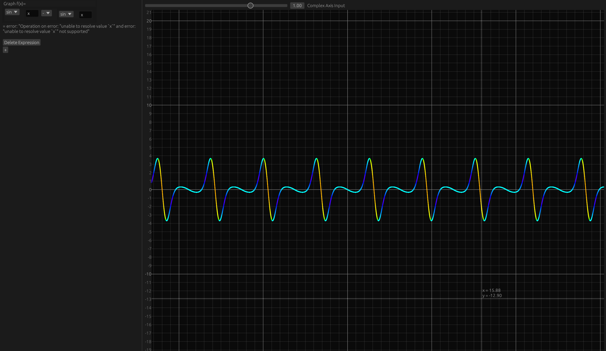

## Comp-RS [placeholder name]

This is a calculator I'm developing as of this moment!  
While a calculator like this seems like a very simple project, there is a lot of trickiness with this one:

- Complex number support  
- Performant graphing & expression computation  
- Custom node & expression tree system in egui  

Right now it's very barebones, with little support for more complex things like vectors,  
but there will be more support soon!  

A web demo will be available eventually when I figure out how to port this to WASM.  

You can view the source code here: [GitHub Repository](https://github.com/akarahdev/comp-rs)  

*Note: The source code repository is very barebones as of this moment, I will make it look better soon!*